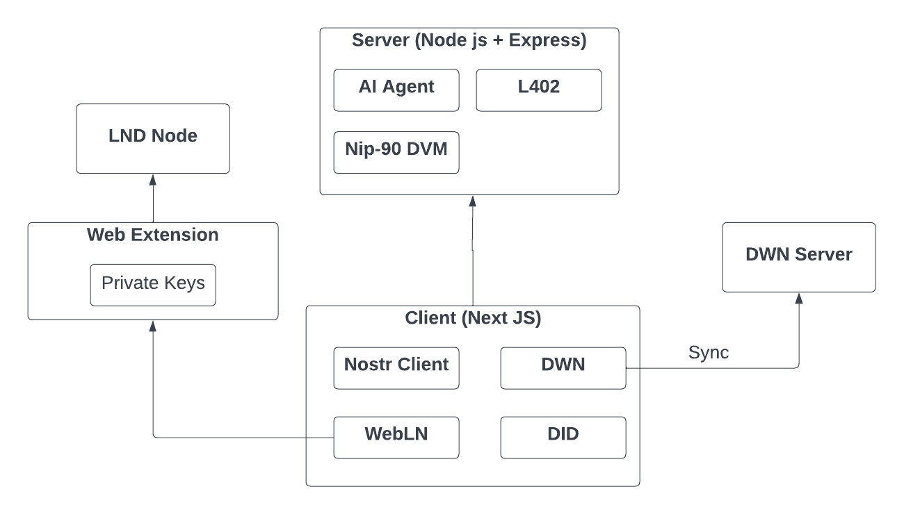

# Netonomy:

Netonomy aims to help people and organizations take control of their digital identity, data and finances.

## 🤯 Features

- 💽 Decentralized Web Node
- 🕸️ Nostr Client
- 🤖 Autonomous Agent
- ⚡️ WebLN
- 💸 L402

### 📜 Requirements

1. WebLN + Nostr Enabled Wallet

### 🎥 AI4All Hackathon Presentation

https://www.loom.com/share/6714ff4fe0c944909278e252e2159e14

## 🏛️ Architecture

## License

Netonomy Wallet is licensed under the terms of the [Apache License](LICENSE).
